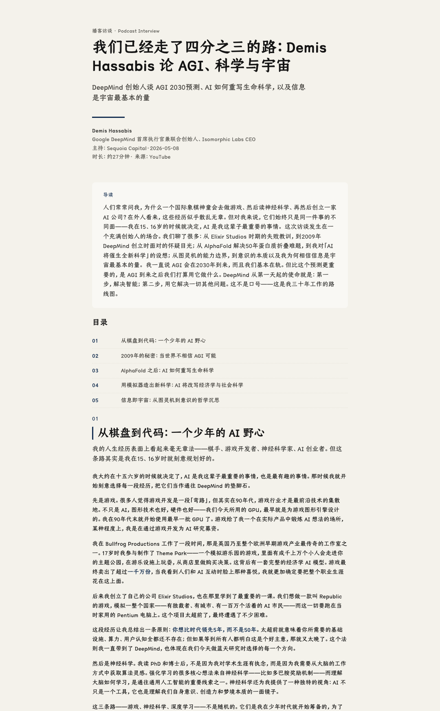
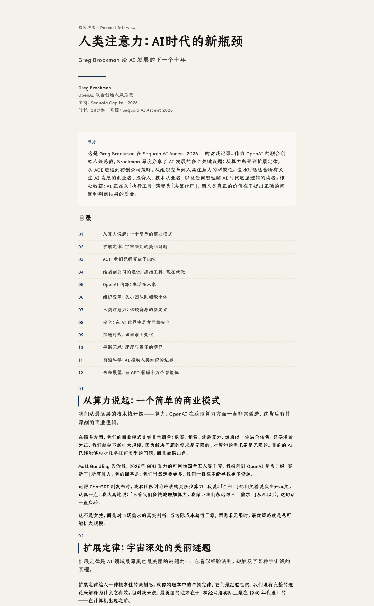

# 阅读播客 (podcast-to-article)

将播客访谈、YouTube 视频字幕转换为结构清晰、阅读友好的长文 HTML。

> 像读书一样读播客——告别流水账，获得有章节、有观点、有引用的深度长文。
>
> 排版风格由 [kami](https://github.com/tw93/kami) 驱动。

---

## AI Agent 使用方法

```
/podcast-to-article path/to/字幕文件.md
/podcast-to-article https://www.youtube.com/watch?v=xxx
```

Agent 自动完成：提取字幕 → AI 摘要 → 章节规划 → 生成 kami 风格长文 HTML。

---

## 功能特性

| 特性 | 说明 |
|------|------|
| 🎧 视频链接直达 | 输入 YouTube 链接，自动提取字幕 |
| 📖 主题化重组 | 按内容语义规划章节，不按时间线堆砌 |
| ✂️ 自适应分块 | 30 分钟到 4–5 小时视频均可处理 |
| 💾 信息完整 | 摘要覆盖 90%+ 原文，保留引用、数据、案例 |
| 🎨 kami 风格 | 羊皮纸质感 HTML，专业排版，开箱即用 |
| 📁 会话隔离 | 每次运行生成独立文件夹，所有中间文件可追溯 |

---

## 适用范围

- **YouTube 视频**：输入链接即可，自动提取字幕
- **含字幕的公开视频**：任何提供字幕的视频内容
- **语言不限**：中文、英文或其他语言的视频均可处理

---

## 效果预览





---

## 快速开始（手动模式）

### 前置要求

```bash
python3 --version   # Python 3.8+
pip install requests
```

### 方式一：直接输入视频链接

```bash
cd podcast-to-article
python3 scripts/run.py --url "https://www.youtube.com/watch?v=xxx"
```

脚本会自动：
1. 提取字幕 → `00_transcript.md`
2. 解析结构化数据 → `01_parsed.json`
3. 分块处理 → `02_chunked.json`
4. 输出 AI 处理提示 → `00_ai_prompt.txt`

然后将 `00_ai_prompt.txt` 的内容交给 AI 依次完成摘要、章节规划、文章生成，最后执行：

```bash
python3 scripts/build_html.py \
    outputs/{会话文件夹}/05_article_data.json \
    assets/template.html \
    outputs/{会话文件夹}/06_final.html
```

### 方式二：本地 Markdown 字幕文件

```bash
python3 scripts/run.py "path/to/transcript.md"
```

---

## 工作流程

```
视频链接 / 本地文件
    ↓ run.py
00_transcript.md     — 原始字幕
    ↓ parse_transcript.py
01_parsed.json       — 结构化解析（说话人、时间线、段落）
    ↓ chunk_text.py
02_chunked.json      — 自适应分块
    ↓ AI + prompts/02-summarize.md
03_batch_*.json      — 各块内容摘要
    ↓ AI + prompts/03-cluster.md
04_chapters.json     — 章节规划
    ↓ AI + prompts/04-compose.md
05_article_data.json — 完整文章数据（JSON）
    ↓ build_html.py
06_final.html        — kami 风格长文 HTML ✅
```

---

## 目录结构

```
podcast-to-article/
├── README.md
├── SKILL.md                 # Agent Skill 描述
├── scripts/
│   ├── run.py               # 主入口：创建会话、提取字幕
│   ├── parse_transcript.py  # 解析 Markdown 字幕为结构化数据
│   ├── chunk_text.py        # 自适应文本分块
│   ├── batch_summarize.py   # 批次摘要辅助工具
│   └── build_html.py        # 将文章 JSON 渲染为 HTML
├── prompts/
│   ├── 01-parse.md          # AI 提示：解析字幕元信息
│   ├── 02-summarize.md      # AI 提示：分块摘要
│   ├── 03-cluster.md        # AI 提示：章节规划
│   └── 04-compose.md        # AI 提示：正文生成
└── assets/
    ├── template.html        # kami 风格 HTML 模板
    ├── fonts/               # 本地字体资源
    ├── exp1.png             # 效果示例图
    └── exp2.png             # 效果示例图
```

---

## 输出结构

每次运行生成独立会话文件夹：

```
outputs/AFpeWo1GTeg_20260508_121359/
├── metadata.json
├── 00_ai_prompt.txt
├── 00_transcript.md
├── 01_parsed.json
├── 02_chunked.json
├── 03_batch_1.json
├── 04_chapters.json
├── 05_article_data.json
└── 06_final.html          ← 最终产出
```

文章目标长度：**8,000–15,000 字**，章节数量根据视频时长自动调整（30 分钟视频约 4–6 章）。

---

## 设计理念

1. **AI 做创意**：理解内容、提炼观点、规划章节结构
2. **脚本做执行**：字幕提取、分块、模板渲染，稳定可复现
3. **人工可介入**：任何中间文件均可手动编辑后重新执行后续步骤

---

## License

MIT
